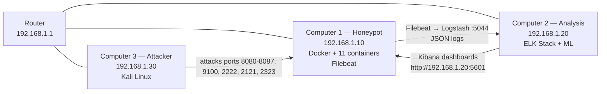

# AI Based Honeypot IDS using Docker Containers and Centralized Log Analysis

> **Final Year Cyber Security Project — Complete Documentation & Implementation Guide**
>
> ⚠️ **EDUCATIONAL USE ONLY — AUTHORIZED LABORATORY RESEARCH**
> This project is designed exclusively for use inside an isolated, controlled laboratory network.
> Never run these tools, containers, or attack scripts against any system you do not own or do not
> have explicit written authorization to test. Unauthorized access to computer systems is a criminal
> offense under the Computer Fraud and Abuse Act (CFAA), the UK Computer Misuse Act, India's IT Act
> 2000, and equivalent laws worldwide.

---

## 1. Project Overview

This project demonstrates a complete, research-grade **deception-based Intrusion Detection System
(IDS)** built around three networked computers. A honeypot of intentionally vulnerable Docker
containers (emulating IoT devices and common servers) lures attackers. All interaction is logged,
forwarded to a centralized SIEM (ELK Stack), visualized, transformed into a structured dataset, and
used to train a machine-learning IDS model. The trained model is **not** wired into live detection —
it is produced as a deployable artifact that can later be integrated into enterprise SIEMs,
firewalls, endpoint security products, or cloud security platforms.

### 1.1 Why a Honeypot?

A honeypot is a decoy system with no production value. Any traffic to it is, by definition,
suspicious. This produces extremely clean labeled data for training intrusion detectors, and it lets
us study attacker behavior without risk to real assets.

### 1.2 Why Docker?

Docker gives us isolation, reproducibility, fast spin-up/teardown, and per-container logging. Each
emulated IoT device is a self-contained container with its own filesystem, network stack, and
log stream.

### 1.3 Why Centralized Logging?

Forwarding all logs to a single SIEM gives a unified timeline, enables correlation across
containers, and is exactly how a real Security Operations Center (SOC) operates.

### 1.4 Why Train (But Not Deploy) the Model?

The academic deliverable is the **methodology**: prove that logs from a Docker honeypot can be
transformed into a labeled dataset capable of training a high-accuracy multi-class classifier.
Deployment is treated as future engineering work — the documentation explains precisely how the
saved `model.joblib` + `scaler.joblib` artifacts would be loaded by a SIEM, firewall, or EDR.

---

## 2. Objectives

1. Deploy 11 intentionally vulnerable Docker containers emulating IoT devices and common services.
2. Emit structured JSON logs for every network interaction (benign and malicious).
3. Forward logs in real time to a centralized ELK Stack.
4. Visualize attacks in Kibana dashboards (top attackers, ports, containers, timelines, heatmaps).
5. Convert raw logs into a cleaned, encoded, scaled, labeled ML dataset.
6. Train and evaluate six classifiers (Decision Tree, Random Forest, SVM, XGBoost, LightGBM,
   Logistic Regression baseline).
7. Select the best model via cross-validation and save it as a reusable artifact.
8. Document the entire pipeline to presentation-grade quality.

---

## 3. Repository Structure

```
AI-Honeypot-IDS/
│
├── README.md                       ← This file (master documentation)
│
├── Computer-1-Honeypot/            ← Honeypot server (Docker containers + Filebeat)
│   ├── README.md                   ← Presenter notes for Computer 1
│   ├── docker-compose.yml
│   ├── .env.example
│   ├── Makefile
│   ├── containers/                 ← One folder per emulated device
│   │   ├── camera/   (CCTV, port 8081)
│   │   ├── microwave/ (Smart Microwave, port 8082)
│   │   ├── smarttv/   (Smart TV, port 8083)
│   │   ├── smartlight/ (Smart Light, port 8084)
│   │   ├── router/    (Router Login Panel, port 8085)
│   │   ├── nas/       (NAS Storage, port 8086)
│   │   ├── printer/   (Printer, ports 8087 + 9100)
│   │   ├── ssh/       (SSH, port 2222)
│   │   ├── ftp/       (FTP, port 2121)
│   │   ├── http/      (Vulnerable Web App, port 8080)
│   │   └── telnet/    (Telnet, port 2323)
│   ├── configs/                    ← Filebeat + logging configs
│   ├── scripts/                    ← start/stop/status/healthcheck/seed scripts
│   └── logs/                       ← Local log cache (also centralized)
│
├── Computer-2-Analysis/            ← SIEM + ML training machine
│   ├── README.md                   ← Presenter notes for Computer 2
│   ├── elk/                        ← Elasticsearch, Logstash, Kibana configs
│   │   ├── elasticsearch/
│   │   ├── logstash/
│   │   ├── kibana/
│   │   └── docker-compose-elk.yml
│   ├── ml/                         ← Machine-learning pipeline
│   │   ├── src/                    ← Python source (ingest, features, train, evaluate)
│   │   ├── data/                   ← Raw + processed datasets
│   │   ├── models/                 ← Saved model + scaler artifacts
│   │   ├── reports/                ← Confusion matrix, ROC, metrics JSON
│   │   └── notebooks/              ← Exploratory Jupyter notebooks
│   ├── configs/
│   └── dashboards/                 ← Exported Kibana dashboards (NDJSON)
│
├── Computer-3-Attacker/            ← Kali attacker machine
│   ├── README.md                   ← Presenter notes for Computer 3
│   └── scripts/                    ← All attack scripts
│
├── diagrams/                       ← ASCII + Mermaid network/architecture diagrams
├── screenshots/                    ← Screenshot placeholders & capture guide
├── datasets/                       ← Final exported dataset (CSV)
├── trained_models/                 ← Copy of saved model artifacts
├── docs/                           ← 18 detailed markdown documents
├── scripts/                        ← Cross-cutting automation scripts
├── docker/                         ← Shared Docker resources
└── configs/                        ← Global configs (router, firewall, hosts)
```

Every folder above has its own `README.md` or is explained in `docs/`. See **Section 16 — Directory
Explanation** for a complete per-folder breakdown.

---

## 4. Hardware Requirements

| Component            | Minimum                          | Recommended                          |
|----------------------|----------------------------------|--------------------------------------|
| Computers            | 3 (Physical or VM)               | 3 physical PCs                       |
| RAM per machine      | Computer 1: 8 GB, Computer 2: 16 GB, Computer 3: 4 GB | Computer 2: 32 GB |
| CPU                  | 4 cores each                     | 8 cores (Computer 2 for ML training) |
| Storage              | 40 GB SSD each                   | 256 GB SSD (Computer 2 for logs)     |
| Router               | Any 4-port home router           | Gigabit router with managed switch   |
| Ethernet cables      | 3 × Cat5e or better              | 3 × Cat6                             |
| USB Wi-Fi adapters   | Optional                         | Optional                             |
| Internet             | Required only for initial package install | Required for install only     |

> **Lab isolation:** During the demo, the router should NOT be connected to the public Internet.
> This prevents accidental exposure of the vulnerable honeypot containers.

---

## 5. Software Stack

| Layer              | Computer 1 (Honeypot)        | Computer 2 (Analysis)            | Computer 3 (Attacker) |
|--------------------|------------------------------|----------------------------------|------------------------|
| OS                 | Ubuntu Server 22.04 LTS      | Ubuntu Server 22.04 LTS          | Kali Linux 2024.1      |
| Container runtime  | Docker 24+, Docker Compose v2| Docker 24+, Compose v2           | —                      |
| Logging agent      | Filebeat 8.x                 | —                                | —                      |
| SIEM               | —                            | Elasticsearch 8.x, Logstash, Kibana | —                   |
| ML runtime         | —                            | Python 3.11, scikit-learn, XGBoost, LightGBM, pandas, numpy | — |
| Attack tools       | —                            | —                                | nmap, masscan, hydra, nikto, gobuster, dirb, sqlmap, netcat, curl, sshpass |
| Visualization      | —                            | Kibana, matplotlib, seaborn      | —                      |

---

## 6. Network Topology

### 6.1 IP Address Assignment

| Host             | Role            | IP Address     | MAC (example)     |
|------------------|-----------------|----------------|-------------------|
| Router           | Gateway + DHCP  | 192.168.1.1    | 00:1A:2B:3C:4D:5E |
| Computer 1       | Honeypot        | 192.168.1.10   | 00:1A:2B:3C:4D:01 |
| Computer 2       | SIEM + ML       | 192.168.1.20   | 00:1A:2B:3C:4D:02 |
| Computer 3       | Attacker        | 192.168.1.30   | 00:1A:2B:3C:4D:03 |

Static IPs are recommended for all three machines. The router runs DHCP only for convenience but we
reserve the three addresses above.

### 6.2 ASCII Network Diagram

```
                    ┌──────────────────────────────┐
                    │       Home Lab Router         │
                    │       192.168.1.1             │
                    │   (DHCP disabled for lab IPs) │
                    │   NO Internet uplink during   │
                    │   demo (air-gapped)           │
                    └──────────────┬─────────────────┘
                                   │
          ┌────────────────────────┼────────────────────────┐
          │                        │                        │
          │ Ethernet               │ Ethernet               │ Ethernet
          │                        │                        │
   ┌──────▼──────────┐     ┌───────▼─────────┐     ┌────────▼────────┐
   │  COMPUTER 1     │     │   COMPUTER 2    │     │   COMPUTER 3    │
   │  Honeypot       │     │   SIEM + ML     │     │   Attacker      │
   │  192.168.1.10   │     │   192.168.1.20  │     │   192.168.1.30  │
   │                 │     │                 │     │                 │
   │ Docker Engine   │     │ Elasticsearch   │     │ Kali Linux      │
   │ 11 containers   │     │ Logstash :5044  │     │ nmap/hydra/...  │
   │ Filebeat        │     │ Kibana :5601    │     │                 │
   │   ───────────►  │     │  ◄───────────   │     │   ───────►      │
   │   JSON logs     │     │  receives logs  │     │   attacks       │
   │   to :5044      │     │  ML pipeline    │     │                 │
   └─────────────────┘     └─────────────────┘     └─────────────────┘
          ▲                                                   │
          │                                                   │
          └───────────────── attacks hit containers ──────────┘
```

### 6.3 Mermaid Diagram



### 6.4 Connection Explanation

- **Router ↔ each computer:** Single Ethernet cable per machine into router LAN ports. Router
  provides L2/L3 connectivity only. Internet uplink cable is physically unplugged during the demo.
- **Computer 3 → Computer 1:** Attack traffic over TCP to the honeypot ports. No special routing
  needed — same broadcast domain.
- **Computer 1 → Computer 2:** Filebeat on Computer 1 opens a persistent TCP connection to
  Logstash on Computer 2 port 5044 and ships newline-delimited JSON log events.
- **Computer 2 → Computer 1 (optional):** Operator browses Kibana from any machine; the honeypot
  team can also pull dashboards. This is HTTP to port 5601, not a log channel.

---

## 7. Operating System Installation (Summary)

Detailed step-by-step OS install is in `docs/02_Hardware.md` and `docs/03_Network_Setup.md`. Summary:

1. **Computer 1 — Ubuntu Server 22.04 LTS:** minimal install, enable SSH, set static IP
   `192.168.1.10/24`, gateway `192.168.1.1`, DNS `8.8.8.8` (only during setup).
2. **Computer 2 — Ubuntu Server 22.04 LTS:** minimal install, enable SSH, static IP `192.168.1.20`.
3. **Computer 3 — Kali Linux 2024.1:** full install with default toolset, static IP `192.168.1.30`.

All three machines use username `labuser` and a strong lab-only password stored in the sealed
project handover envelope. (Default lab password documented in `docs/03_Network_Setup.md`.)

---

## 8. Docker Setup (Computer 1 & 2)

```bash
# On Computer 1 and Computer 2
sudo apt update && sudo apt install -y ca-certificates curl gnupg lsb-release
sudo install -m 0755 -d /etc/apt/keyrings
curl -fsSL https://download.docker.com/linux/ubuntu/gpg | sudo gpg --dearmor -o /etc/apt/keyrings/docker.gpg
echo "deb [arch=amd64 signed-by=/etc/apt/keyrings/docker.gpg] https://download.docker.com/linux/ubuntu jammy stable" \
  | sudo tee /etc/apt/sources.list.d/docker.list
sudo apt update
sudo apt install -y docker-ce docker-ce-cli containerd.io docker-buildx-plugin docker-compose-plugin
sudo usermod -aG docker $USER
# log out and back in, then verify:
docker --version
docker compose version
```

Full explanation: `docs/04_Docker.md`.

---

## 9. Python Setup (Computer 2)

```bash
sudo apt install -y python3.11 python3.11-venv python3.11-dev build-essential
python3.11 -m venv ~/.venvs/honeypot-ml
source ~/.venvs/honeypot-ml/bin/activate
pip install --upgrade pip
pip install -r Computer-2-Analysis/ml/requirements.txt
```

Virtualenv keeps the ML dependencies isolated from system Python. See `docs/10_Model_Training.md`.

---

## 10. Installation (End-to-End)

### 10.1 Computer 1

```bash
git clone <repo> AI-Honeypot-IDS
cd AI-Honeypot-IDS/Computer-1-Honeypot
cp .env.example .env   # edit LOGSTASH_HOST if needed
make build             # builds all container images
make up                # starts all containers + filebeat
make status            # verify health
```

### 10.2 Computer 2

```bash
cd AI-Honeypot-IDS/Computer-2-Analysis
docker compose -f elk/docker-compose-elk.yml up -d   # start ELK
# wait ~60s for Elasticsearch to be ready
cd ml && source ~/.venvs/honeypot-ml/bin/activate
python src/01_ingest.py        # pull logs from ES into data/raw.parquet
python src/02_features.py      # build features → data/features.parquet
python src/03_train.py         # train all models → models/
python src/04_evaluate.py      # confusion matrix, ROC, metrics → reports/
```

### 10.3 Computer 3

```bash
cd AI-Honeypot-IDS/Computer-3-Attacker
chmod +x scripts/*.sh
./scripts/run_all_attacks.sh   # executes full attack suite against 192.168.1.10
```

---

## 11. How the Three Computers Communicate

| Channel                       | Source → Destination          | Protocol / Port      | Purpose                          |
|-------------------------------|-------------------------------|----------------------|----------------------------------|
| Attack traffic                | Computer 3 → Computer 1       | TCP 8080-8087, 9100, 2222, 2121, 2323 | Attacker probes honeypot |
| Log shipping                  | Computer 1 → Computer 2       | TCP 5044 (Beats/Lumberjack) | Filebeat → Logstash        |
| Kibana UI                     | Any → Computer 2              | TCP 5601 (HTTPS/HTTP)     | View dashboards                |
| Elasticsearch REST (internal) | Computer 2 localhost          | TCP 9200              | Logstash/Kibana → Elasticsearch  |
| SSH (admin)                   | Operator → any machine        | TCP 22                | Remote administration            |

### 11.1 Firewall Rules

**Computer 1 (ufw):**
```bash
sudo ufw default deny incoming
sudo ufw default allow outgoing
sudo ufw allow from 192.168.1.0/24 to any port 22      proto tcp   # SSH admin
sudo ufw allow from 192.168.1.0/24 to any port 8080:8087 proto tcp # honeypot web
sudo ufw allow from 192.168.1.0/24 to any port 9100     proto tcp   # printer raw
sudo ufw allow from 192.168.1.0/24 to any port 2222     proto tcp   # ssh honeypot
sudo ufw allow from 192.168.1.0/24 to any port 2121     proto tcp   # ftp honeypot
sudo ufw allow from 192.168.1.0/24 to any port 2323     proto tcp   # telnet honeypot
sudo ufw allow from 192.168.1.20 to any port 5044       proto tcp   # NOT needed (outbound)
sudo ufw enable
```

**Computer 2 (ufw):**
```bash
sudo ufw default deny incoming
sudo ufw default allow outgoing
sudo ufw allow from 192.168.1.0/24 to any port 22     proto tcp
sudo ufw allow from 192.168.1.0/24 to any port 5601   proto tcp   # Kibana
sudo ufw allow from 192.168.1.10 to any port 5044     proto tcp   # Filebeat ingest
sudo ufw enable
```

**Computer 3:** No inbound firewall restrictions — it is the attacker.

---

## 12. Data Flow / Packet Flow / Log Flow / Model Training Flow

### 12.1 Packet Flow (attack)

```
Attacker (192.168.1.30)
   │  TCP SYN to 192.168.1.10:8080
   ▼
Router (192.168.1.1) — L3 forward
   │
   ▼
Computer 1 (192.168.1.10)
   │  DNAT to Docker bridge 172.20.0.0/16
   ▼
http container (172.20.0.11:8080)
   │  Flask app handles request, logs JSON to stdout
   ▼
Docker json-file logging driver captures stdout
   ▼
Filebeat autodiscover picks up container logs
```

### 12.2 Log Flow

```
Container stdout (JSON)
   ▼
Docker json-file driver
   ▼
Filebeat (autodiscover + container input)
   ▼
TCP 5044 → Logstash (Computer 2)
   ▼
Logstash: grok/json parse → enrich (geoip, attack_type) → Elasticsearch
   ▼
Elasticsearch index: honeypot-logs-YYYY.MM.dd
   ▼
Kibana dashboards (real-time)
   ▼
ML ingest script (01_ingest.py) queries ES → data/raw.parquet
```

### 12.3 Model Training Flow

```
data/raw.parquet
   ▼ 02_features.py (feature engineering + label propagation)
data/features.parquet
   ▼ 03_train.py (split, scale, CV, train 6 models)
models/{dt,rf,svm,xgb,lgbm,logreg}.joblib + scaler.joblib
   ▼ 04_evaluate.py (confusion matrix, ROC, metrics.json)
reports/  + trained_models/ (copy)
```

---

## 13. Presentation Flow / Demo Flow

See `docs/12_Demonstration.md` for the minute-by-minute script. High level:

1. Power on router, verify link lights on all three machines.
2. SSH into each machine, confirm IPs with `ip a`.
3. On Computer 1: `make up`, run `make status`, show all 11 containers healthy.
4. On Computer 2: verify ELK is up, open Kibana in browser, show empty index.
5. On Computer 3: run `./scripts/run_all_attacks.sh`.
6. Switch back to Kibana: show live attack logs streaming in.
7. Walk through each dashboard (top attackers, ports, containers, timeline, heatmap).
8. On Computer 2: run `01_ingest.py` → `02_features.py` → show dataset stats.
9. Run `03_train.py` → `04_evaluate.py` → show confusion matrix + ROC.
10. Compare model metrics, justify the chosen model.
11. Explain future deployment paths (SIEM, firewall, EDR, cloud).
12. Q&A.

---

## 14. Troubleshooting (Quick Reference)

Full guide: `docs/13_Troubleshooting.md`.

| Symptom                                   | Likely cause                          | Fix                                          |
|-------------------------------------------|---------------------------------------|----------------------------------------------|
| Containers show `unhealthy`               | App crashed / port conflict           | `docker logs <name>`; check `make status`    |
| No logs in Kibana                         | Filebeat can't reach Logstash         | Check `LOGSTASH_HOST`, ufw 5044 on Comp 2    |
| Logstash rejects logs                     | Schema mismatch                       | Check `logstash/conf.d/10-honeypot.conf`     |
| Elasticsearch red cluster                 | Disk watermark hit (>85%)             | `curl -XDELETE 'honeypot-logs-*'` old indices|
| ML training OOM                           | Insufficient RAM                      | Reduce CV folds, subsample dataset           |
| XGBoost install fails                     | Missing build tools                   | `apt install build-essential python3.11-dev` |

---

## 15. Future Work

- Real-time model inference wired into Logstash (drop-in `model_inference` filter).
- Honeypot federation: multiple geographically distributed honeypots feeding one SIEM.
- Threat-intel enrichment (AbuseIPDB, VirusTotal) in Logstash.
- Adversarial robustness testing of the trained classifier.
- Container escape detection on the honeypot host itself (Falco).
- Automated attack replay from captured PCAPs.

---

## 16. Limitations

- Lab network is air-gapped; results may not generalize to Internet-facing honeypots.
- Container emulation is shallow — real IoT firmware may behave differently.
- Dataset is imbalanced (few attack classes). Addressed via class weights + SMOTE in training.
- The trained model is **not** deployed in this project (by design — see Section 1.4).
- No persistent state across container restarts (honeypot is ephemeral by design).

---

## 17. Directory Explanation (every folder)

| Folder                          | Purpose                                                                 |
|---------------------------------|-------------------------------------------------------------------------|
| `Computer-1-Honeypot/`          | All honeypot-side code, containers, configs, scripts                    |
| `Computer-1-Honeypot/containers/` | One subfolder per emulated IoT device/server, each with Dockerfile+app |
| `Computer-1-Honeypot/configs/`  | Filebeat config, log driver config                                     |
| `Computer-1-Honeypot/scripts/`  | start/stop/status/healthcheck/seed-traffic shell scripts               |
| `Computer-1-Honeypot/logs/`     | Local rotated log cache (logs are ALSO centralized to Computer 2)       |
| `Computer-2-Analysis/elk/`      | ELK Stack compose + per-service configs                                 |
| `Computer-2-Analysis/ml/`       | Python ML pipeline (ingest, features, train, evaluate)                  |
| `Computer-2-Analysis/dashboards/` | Exported Kibana dashboards (NDJSON) for one-click import               |
| `Computer-3-Attacker/scripts/`  | Bash + Python attack scripts                                            |
| `diagrams/`                     | ASCII and Mermaid architecture diagrams                                 |
| `screenshots/`                  | Capture guide + placeholders for every screenshot in the demo           |
| `datasets/`                     | Final exported labeled CSV dataset                                      |
| `trained_models/`               | Copy of saved model + scaler artifacts                                  |
| `docs/`                         | 18 detailed markdown documents (one per topic)                          |
| `scripts/`                      | Cross-cutting automation (env check, full demo runner)                  |
| `docker/`                       | Shared Docker resources (custom networks, base images)                  |
| `configs/`                      | Global configs (router, hosts file, firewall scripts)                   |

Every file inside these folders is documented in the folder's own README and in the relevant
`docs/NN_*.md` file.

---

## 18. Documentation Index

| #  | Document                          | Topic                                              |
|----|-----------------------------------|----------------------------------------------------|
| 01 | `01_Project_Introduction.md`      | Motivation, scope, ethics                          |
| 02 | `02_Hardware.md`                  | Hardware spec, BIOS, cabling                       |
| 03 | `03_Network_Setup.md`             | Router, IPs, firewall, hosts                       |
| 04 | `04_Docker.md`                    | Docker install, compose, networking                |
| 05 | `05_Containers.md`                | Each container explained                           |
| 06 | `06_Logging.md`                   | Log schema, JSON format, fields                    |
| 07 | `07_Log_Collection.md`            | Filebeat → Logstash pipeline                       |
| 08 | `08_ELK.md`                       | Elasticsearch, Logstash, Kibana setup              |
| 09 | `09_Dataset.md`                   | Dataset creation, labeling, statistics             |
| 10 | `10_Model_Training.md`            | Feature engineering, 6 models, CV                  |
| 11 | `11_Attacks.md`                   | Every attack explained                             |
| 12 | `12_Demonstration.md`             | Minute-by-minute demo                              |
| 13 | `13_Troubleshooting.md`           | Common issues and fixes                            |
| 14 | `14_Future_Work.md`               | Roadmap                                            |
| 15 | `15_FAQ.md`                       | Frequently asked questions                         |
| 16 | `16_Project_Presentation.md`      | Speaking scripts per presenter                     |
| 17 | `17_Viva_Questions.md`            | Likely viva questions + answers                    |
| 18 | `18_References.md`                | Papers, tools, standards                           |

---

## 19. Ethical & Legal Notice

This project is submitted in partial fulfillment of the degree requirements for the B.Tech / BSc
Cyber Security program. It is intended solely for educational demonstration inside an authorized,
air-gapped laboratory. The authors and the institution do not endorse the use of these techniques
against any system without explicit authorization. All attack tools are used against self-owned
honeypot assets within a private network.

**Before running any component:**
1. Confirm the router has NO uplink to the public Internet.
2. Confirm all three machines are on `192.168.1.0/24` only.
3. Do not expose ports 8080-8087, 9100, 2222, 2121, 2323 beyond the lab subnet.
4. Do not run attack scripts against any IP other than `192.168.1.10`.

---

## 20. License

This project is released under the MIT License for academic reuse. See `LICENSE` (if included) or
the LICENSE section of each sub-README. Commercial use of the intentionally vulnerable containers is
not recommended.

---

## 21. Citation

If you reference this work in academic material, cite as:

> *AI Based Honeypot IDS using Docker Containers and Centralized Log Analysis.* Final Year Project,
> Department of Cyber Security, [University Name], [Year].

---

## 22. Quick Start (TL;DR)

```bash
# Computer 1
cd Computer-1-Honeypot && cp .env.example .env && make build && make up && make status

# Computer 2
cd Computer-2-Analysis && docker compose -f elk/docker-compose-elk.yml up -d
# open http://192.168.1.20:5601

# Computer 3
cd Computer-3-Attacker && ./scripts/run_all_attacks.sh
```

Then watch logs stream into Kibana, run the ML pipeline, and present.

---

**End of master README.** Continue reading the per-computer READMEs and the `docs/` folder for full
detail.
